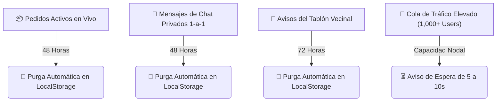

# 🏗️ Arquitectura del Sistema NOTIGAS (Web App)

## 📌 Visión General
**NOTIGAS** es una aplicación web barrial multiplataforma en tiempo real optimizada para alta afluencia de usuarios (hasta 1,000+ simultáneos), geolocalización GPS obligatoria de baja latencia, Mini Páginas de Negocio para Repartidores (estilo Facebook) y Foro Comunitario Vecinal (estilo Reddit).

---

## ⚡ Reglas de Expiración & Auto-Purga de Base de Datos

| Tipo de Contenido | Tiempo de Caducidad | Mecanismo de Limpieza |
| :--- | :--- | :--- |
| **Pedidos Activos** | **48 Horas** | Eliminación automática por `ejecutarPurgaBaseDeDatosAuto()` |
| **Mensajes de Chat Privado** | **48 Horas** | Depuración automática aislada por usuario y repartidor |
| **Avisos del Tablón Vecinal** | **72 Horas (3 Días)** | Purga de posts antiguos para mantener rápida la aplicación |
| **Control de Tráfico (1,000+ Users)** | **Aviso 5-10 segundos** | Throttling asincrónico no bloqueante |

---

## 🔐 Seguridad & Panel de Administración

1. **Pantalla de Login Protegida:**
   - Para acceder a las funciones de administración, la aplicación presenta **únicamente** la pantalla de inicio de sesión de Administrador.
   - Requiere Usuario Gmail autorizado (`erikmartinelly@gmail.com` o `leonmartinelly13@gmail.com`) y Contraseña `Tiquipaya428`.
2. **Funciones del Administrador:**
   - Configuración de ID Google AdSense (`ca-pub-xxxxxxxxxxxxxx`) y banners nativos.
   - Exportación de correos Gmail en formato `.CSV`.
   - **Panel de Moderación de Denuncias:** Revisión de reportes por spam o conducta indebida.
   - **Gestión de Baneos:** Baneo manual de usuarios molestos o molestos desde el Panel o **directamente desde el Chat con 1 clic**.

---

## 🖼️ Favicon Dinámico por Pedido Activo
- **Garrafa GLP**: Icono SVG de cilindro de propano.
- **Detergentes**: Icono SVG de dispensador de jabón.
- **Agua 20L**: Icono SVG de botellón de agua.
- **Chatarra**: Icono SVG de reciclaje metal.
- **Papel**: Icono SVG de hoja/periódico.
- **Frutas**: Icono SVG de fruta/manzana.
- **Carbón**: Icono SVG de llama de fuego.
- **Otros**: Icono SVG de caja abierta.
- Restablece el camión garrafero predeterminado (`favicon.svg?v=4`) al cancelar el pedido.
