# 📐 ARQUITECTURA Y LÓGICA DE NEGOCIO NOTIGAS: MINI FACEBOOK DE NEGOCIOS & MINI REDDIT VECINAL

> **Propósito:** Este documento consolida la arquitectura completa, el flujo de datos, reglas de privacidad y sistema visual de la plataforma web **NOTIGAS**, diseñada como una solución barrial híbrida entre **Mini Páginas de Negocio estilo Facebook** y un **Mini Reddit Vecinal**.

---

## 📌 Datos Clave del Proyecto y Despliegue

- **Nombre del Proyecto:** NOTIGAS (Gas GLP, Detergentes & Limpieza, Chatarra, Papel / Reciclaje, Frutas & Verduras, Carbón / Leña & Foro Vecinal)
- **Repositorio Oficial GitHub:** `https://github.com/erikmartinelly/notigasweb.git`
- **Dominio en Vivo (Hostinger):** `https://notigas.com`
- **Ruta de Código Fuente Principal:** `C:\Users\FTL\Documents\APP NOTIGAS`

---

## 📊 Grafo de Arquitectura y Flujo de Componentes (Mermaid)

```mermaid
graph TD
    User([👤 Cliente / Vecino / Repartidor]) -->|Accede a notigas.com| WebApp[🌐 WebApp NOTIGAS index.html]
    
    subgraph "Capa de Autenticación & Registro Anónimo"
        WebApp -->|Primera Visita| AuthModal[🔐 Registro & Acceso NOTIGAS]
        AuthModal -->|Cliente / Vecino| StoreCliente[(💾 Gmail + Nombre + Apellido)]
        AuthModal -->|Repartidor| StoreDriver[(💾 Nombre + WhatsApp + Placa + Tipo de Repartidor + ¿Qué reparte?)]
        StoreDriver -->|Auto-Apertura| Tab2Auto[🏪 Ficha Creada Automáticamente en Pestaña REPARTIDORES]
    end

    subgraph "Navegación Principal por Pestañas"
        WebApp --> Tab1[🗺️ Pestaña 1: MAPA EN VIVO & GPS]
        WebApp --> Tab2[🏪 Pestaña 2: MINI PÁGINAS DE NEGOCIO FACEBOOK - REPARTIDORES]
        WebApp --> Tab3[💬 Pestaña 3: MINI REDDIT VECINAL & CHAT]
    end

    subgraph "Pestaña 1: Mapa GPS HD & Silueta GLP"
        Tab1 --> GPSAuto[🛰️ Conexión GPS Hardware Automática]
        Tab1 --> LeafletMap[🌍 Mapa Leaflet + Google Maps / Satélite HD]
        LeafletMap --> MarkerGarrafa[🔥 Marcador Silueta SVG Garrafa GLP]
        Tab1 --> SearchBox[🔍 Búsqueda Nominatim por Calle/OTB]
        Tab1 --> MainBtn[📦 Botón Único: HACER UN PEDIDO EN VIVO]
        Tab1 --> PanicBtn[🛑 Botón Pánico ESPÉRAME]
    end

    subgraph "Pestaña 2: Mini Páginas de Negocio (Estilo Facebook)"
        Tab2 --> FilterBar[🏷️ Chips Filtradores: Gas GLP, Detergentes, Chatarra, Papel, Frutas, Carbón]
        Tab2 --> VendorGrid[🏪 Fichas de Negocio: Nombre, WhatsApp, Placa, Oferta]
        VendorGrid --> PrivateChatBtn[💬 CHAT PRIVADO 1-A-1 CON REPARTIDOR]
        Tab2 --> FeedAds1[📢 Propaganda Intercalada en el Feed]
    end

    subgraph "Pestaña 3: Mini Reddit Vecinal & Chat 1-a-1"
        Tab3 --> SubTab1[💬 Sub-Pestaña 1: Mini Reddit Vecinal]
        SubTab1 --> RedditFeed[💬 Feed Comunitario OTB]
        RedditFeed --> UpvoteDownvote[▲ / ▼ Votos Me Gusta / Me Disgusta]
        RedditFeed --> CommentsModal[💬 Hilos de Comentarios]
        RedditFeed --> ReportBtn[🚩 Denunciar Publicación / Acoso]
        RedditFeed --> Expiration7Days[⏱️ Expiración de Anuncios: 7 Días]
        SubTab1 --> FeedAds2[📢 Propaganda Intercalada en Feed Reddit]

        Tab3 --> SubTab2[📱 Sub-Pestaña 2: Chat Privado Cliente ↔ Repartidor]
        SubTab2 --> PrivateChat[🔒 Chat 1-a-1 Aislado e Invisible a Terceros]
        PrivateChat --> Expiration48Hours[⏱️ Borrado Automático de Chats: 48 Horas]
    end

    subgraph "Administración Autorizada & CRM Email Marketing"
        HeaderGear[⚙️ Configuración] --> AdminModal[⚙️ Modal Administración]
        AdminModal --> RestrictedAuth[🔐 Acceso Exclusivo: erikmartinelly@gmail.com / leonmartinelly13@gmail.com]
        RestrictedAuth --> CSVExport[📥 Descargar Correos Gmail .CSV para Ofertas Puntuales]
    end
```

---

## 🎨 Sistema de Diseño Visual y Estilos (Design System)

- **Icono Oficial de la Pestaña del Navegador:** Camión de Gas GLP (`favicon.svg?v=4`).
- **Paleta de Colores Curada (Dark Glassmorphism):**
  - **Fondo Base:** `#0F172A` (Slate Dark)
  - **Tarjetas y Header:** `#1E293B` (Dark Slate Container)
  - **Acento Primario GLP:** `#FF6D00` (Naranja Fuego GLP)
  - **Agua / GPS / Chat:** `#0288D1` (Azul Purificado)
  - **Reciclaje / Chatarra / Exito:** `#00E676` (Verde Esmeralda)
  - **Botón de Pánico / Reporte:** `#D32F2F` (Rojo Caramelo)
- **Tipografía:** Google Font **Roboto** (`400`, `500`, `700`, `900`).

---

## ⚙️ Reglas de Negocio e Integridad Estricta

### 1. Privacidad de Datos y Registro de Repartidores:
- **Clientes / Vecinos:** Ingresan **Correo Gmail, Nombre y Apellido**.
- **Repartidores:** Registro simplificado **SIN CORREO EXIGIDO**. Solo piden **Nombre, WhatsApp (ej: 70712345), Placa del Vehículo, Tipo de REPARTIDOR (Gas, Detergentes, Chatarra, Papel, Frutas, Otros) y Detalle de la oferta**.
- **Apertura Automática:** Al registrarse como Repartidor, el sistema genera automáticamente su Mini Página de Facebook y abre la Pestaña 2 (**REPARTIDORES**).

### 2. Chat 1-a-1 Privado y Borrado a las 48 Horas:
- Toda la coordinación de pedidos (*"necesito gas"*) entre el cliente y el repartidor es **100% privada e invisible para otros vecinos**.
- Los chats expiran y se depuran automáticamente a las **48 horas** (`CHAT_EXPIRATION_MS`) para proteger la privacidad.

### 3. Mini Reddit Vecinal con Publicaciones Gratuitas (7 Días):
- Cualquiera puede publicar avisos gratis en el tablón.
- Incluye votos estilo Reddit (`▲ Me Gusta` / `▼ Me Disgusta`), comentarios e icono **`🚩 Denunciar Publicación`** para acoso, bullying o contenido inapropiado.
- Los anuncios del tablón duran **1 semana (7 días)** y luego se eliminan automáticamente.

---

## 🛠️ Instrucciones de Despliegue en GitHub Desktop e Hostinger

1. Todos los cambios han sido consolidados e integrados en `C:\Users\FTL\Documents\APP NOTIGAS`.
2. Sincronizado en la rama principal `main` de GitHub.
3. En el panel de control de **Hostinger**, presionar el botón **"Re-desplegar" (Redeploy)** en el sitio `notigas.com`.
