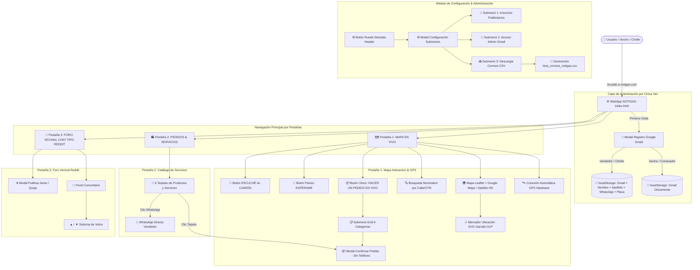

# 📐 ARQUITECTURA, DISEÑO Y LÓGICA COMPLETA DE LA APLICACIÓN WEB NOTIGAS

> **Propósito:** Este documento consolida el 100% de la arquitectura, diseño visual, flujo de datos, grafos mermaid de componentes y reglas de negocio de la plataforma web **NOTIGAS**. Sirve como guía técnica de continuidad para el cambio de conversación.

---

## 📌 Datos Clave del Proyecto y Despliegue

- **Nombre del Proyecto:** NOTIGAS (Gas GLP, Agua 20L, Frutas, Chatarra, Detergentes & Foro Vecinal)
- **Repositorio Oficial GitHub:** `https://github.com/erikmartinelly/notigasweb.git`
- **Dominio en Vivo (Hostinger):** `https://notigas.com`
- **Ruta de Código Fuente Principal:** `C:\Users\FTL\Documents\Codex\2026-07-24\referenced-chatgpt-conversation-this-is-untrusted\outputs\notigas\notigasweb\index.html`

---

## 📊 Grafo de Arquitectura y Flujo de Componentes (Mermaid)

---

## 🎨 Sistema de Diseño Visual y Estilos (Design System)

- **Paleta de Colores Curada (Modo Oscuro Premium Glassmorphism):**
  - **Fondo Base:** `#0F172A` (Slate Dark)
  - **Tarjetas y Header:** `#1E293B` (Dark Slate Container)
  - **Acento Primario NOTIGAS:** `#FF6D00` (Naranja Fuego GLP)
  - **Secundario Agua / GPS:** `#0288D1` (Azul Purificado)
  - **WhatsApp / Vendedores:** `#25D366` & `#00E676` (Verde Esmeralda)
  - **Botón de Pánico / Espérame:** `#D32F2F` & `#B71C1C` (Rojo Gradiente)
- **Tipografía:** Google Font **Roboto** (`400`, `500`, `700`, `900`).
- **Iconografía Oficial:**
  - Marcador de ubicación en el mapa: Silueta vectorial SVG oficial de **Garrafa de Gas GLP** (`<svg class="garrafa-icon-svg">`).
  - Iconos PWA y Favicon en alta definición con cache-busting `?v=2`.

---

## ⚙️ Reglas de Negocio e Integridad Estricta

### 1. Autenticación y Privacidad de Datos:
- **Compradores / Vecinos:** Se autentican únicamente con su **Correo Google Gmail**. **NO SE LES PIDE NÚMERO DE TELÉFONO EN NINGÚN MOMENTO**.
- **Vendedores / Choferes:** Al registrarse como repartidores, ingresan Gmail, Nombre, Apellido, Número de WhatsApp (público para compradores) y Placa del Vehículo.
- **Persistencia:** Se guarda de forma única y permanente en `localStorage` (`notigas_user_data`).

### 2. Pestaña 3 (Foro Vecinal Reddit):
- La **tercera pestaña** de la navegación (`tab2`, índice 2) está dedicada exclusivamente al **Foro Vecinal Estilo Reddit**.
- Permite votos de subida/bajada (`▲` / `▼`), categorización de publicaciones (Queja Vecinal, Apoyo Vecinal, Aviso de Camión, Intercambio) y creación de temas en vivo.

### 3. Módulo de Administración y Exportación CSV:
- El modal de administración (`#modalAdmin`) cuenta con pestañas de submenús internos:
  - **Anuncios:** Permite editar el texto del banner inferior y el enlace de contacto.
  - **Acceso Admin:** Validación con Gmail y clave.
  - **Descargar Correos (.CSV):** Botón `📥 Descargar Correos Gmail (.CSV)` que ejecuta `descargarListaCorreosCSV()`, produciendo un archivo delimitado por comas (`Email,Rol,Fecha`).

### 4. Geolocalización Automática:
- Al iniciar la WebApp, `navigator.geolocation.getCurrentPosition` posiciona de inmediato el mapa y el punto de pedido en las coordenadas exactas del hardware GPS del dispositivo.

---

## 🛠️ Instrucciones de Despliegue en GitHub Desktop e Hostinger

1. Abrir **GitHub Desktop** en el repositorio `notigasweb` (`C:\Users\FTL\Documents\Codex\2026-07-24\referenced-chatgpt-conversation-this-is-untrusted\outputs\notigas\notigasweb`).
2. Presionar el botón **"Push origin"** arriba a la derecha.
3. En el panel de control de **Hostinger**, presionar el botón **"Re-desplegar" (Redeploy)** en el sitio `notigas.com`.
