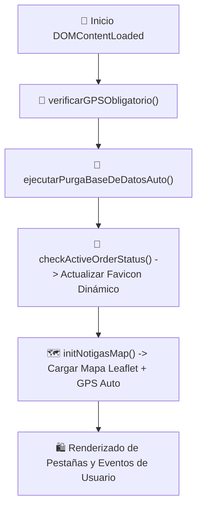

# 📖 Manual del Desarrollador & Guía de Mantenimiento - NOTIGAS Web App

---

## 📌 1. Visión General del Sistema y Propósito
**NOTIGAS** es una plataforma web barrial en tiempo real optimizada para dispositivos móviles y computadoras. Conecta a vecinos con repartidores (camiones garraferos de Gas GLP, botellones de Agua 20L, chatarra, detergentes, alimentos, etc.) mediante geolocalización GPS obligatoria, Mini Páginas de Negocio estilo Facebook por categoría, Foro Comunitario estilo Reddit y un Módulo Independiente de Chat Privado 1-a-1.

---

## 📁 2. Estructura de Directorios y Archivos

```
APP NOTIGAS/
├── index.html                   # Interfaz de usuario principal (SPA) y Modales
├── styles/
│   └── main.css                 # Sistema de diseño de alto rendimiento (Glassmorphic Dark Mode)
├── js/
│   ├── app.js                   # Controlador principal, Modos Vecino/Repartidor, Favicon y Purga DB
│   ├── map.js                   # Integración Leaflet JS, GPS en Vivo, Marcadores SVG GLP y Heatmap
│   ├── vendors.js               # Módulo 2ª Pestaña: Mini Páginas de Negocio y Servicio al Cliente
│   ├── forum.js                 # Módulo 3ª Pestaña: Tablón Vecinal Mini Reddit (Votos, Comentarios)
│   ├── chat.js                  # Módulo 4ª Pestaña: Chats Privados 1-a-1 (Messenger OTB)
│   ├── admin.js                 # Panel de Administración Protegido, Moderación, Baneos y CSV
│   └── auth.js                  # Autenticación Google Identity (1-Tap) y Registro por Correo
├── favicon.svg                  # Ícono PWA predeterminado de Camión Garrafero GLP
├── favicon.png                  # Ícono PNG en alta resolución para navegadores móviles
├── manifest.json                # Configuración de Progressive Web App (PWA)
├── ARCHITECTURE.md              # Documentación de arquitectura técnica del sistema
├── MANUAL_DESARROLLADOR.md      # Este manual de mantenimiento para desarrolladores humanos
└── .gitignore                   # Reglas de exclusión para control de versiones Git
```

---

## ⚙️ 3. Flujo de Ejecución e Inicialización



Al cargarse `index.html`, la secuencia de funciones en JavaScript ejecuta:
1. `verificarGPSObligatorio()`: Solicita acceso al sensor GPS del dispositivo.
2. `ejecutarPurgaBaseDeDatosAuto()`: Elimina datos caducados en `localStorage` (Pedidos > 48h, Chats > 48h, Avisos > 72h).
3. `checkActiveOrderStatus()`: Verifica si hay un pedido activo y actualiza el **Favicon SVG dinámico** y el título de la pestaña.
4. `initNotigasMap()`: Inicializa la instancia del mapa Leaflet JS con capas HD de Google Maps / Satélite.

---

## 🧩 4. Arquitectura de las 4 Pestañas Principales

### 📍 Pestaña 1: Mapa en Vivo (`#tab0`)
- **Controlador:** `js/map.js`
- **Funcionalidades:**
  - Marcador de usuario con silueta 3D de **Garrafa GLP Naranja** (`garrafaIcon`).
  - Marcador animado de **Camión Garrafero en Ruta** (`truckIcon`).
  - Botón **`📦 HACER UN PEDIDO EN VIVO`**: Abre `#modalSubmenu`.
  - Botón **`🛑 ESPÉRAME`**: Lanza aviso de parada urgente al repartidor cercano.
  - Botón **`🔔 ESCUCHÉ AL CAMIÓN`**: Notifica avistamiento voluntario del camión.

### 🏪 Pestaña 2: Repartidores & Servicios Barriales (`#tab1`)
- **Controlador:** `js/vendors.js`
- **Funcionalidades:**
  - Filtro por 8 categorías: Gas GLP, Agua 20L, Chatarra, Papel/Cartón, Frutas/Verduras, Detergentes, Carbón/Leña y Otros.
  - Tarjeta fijada de **`🎧 SERVICIO AL CLIENTE & SOPORTE OTB`** al inicio del feed.
  - Botón **`💬 CHAT PRIVADO INTERNO`**: Redirige directamente a la Pestaña 4.

### 💬 Pestaña 3: Vecinos Reddit (`#tab2`)
- **Controlador:** `js/forum.js`
- **Funcionalidades:**
  - Tablón de avisos comunitarios estilo Reddit con votos ▲/▼ e hilos de comentarios.
  - **Duración máxima de 72 horas:** Los posts expiran automáticamente tras 3 días.
  - Botón **`🚩 Denunciar Publicación`**: Envía reportes al Panel de Administración.

### ✉️ Pestaña 4: Chats Privados Independientes (`#tab3`)
- **Controlador:** `js/chat.js`
- **Funcionalidades:**
  - Conversaciones 1-a-1 encriptadas (estilo Messenger móvil / Google Meet).
  - Selector de destinatarios (Soporte OTB, Repartidor Gas, Agua, etc.).
  - **Duración máxima de 48 horas:** Todos los mensajes caducan y son eliminados automáticamente por privacidad y rendimiento.

---

## 🚛 5. Modo Repartidor en Ruta (`setAppMode('driver')`)

El sistema permite alternar en tiempo real entre la vista de **`🛍️ VECINO`** y el **`🚛 MODO REPARTIDOR EN RUTA`**:

- **Activación:** Se activa mediante el botón `#btnModeToggle` en la cabecera o al registrar una ficha de repartidor.
- **Componentes del Modo Repartidor:**
  - **Banner Verde de Estado:** Muestra indicación de transmisión GPS activa.
  - **`🟢 INICIAR / PAUSAR RECORRIDO EN VIVO (GPS)`**: Activa/Pausa la visibilidad del camión en el mapa.
  - **`🔥 MAPA DE CALOR DE PEDIDOS`**: Dibuja círculos de concentración de demanda sobre el mapa Leaflet (`renderHeatmapOverlay()`).
  - **`📋 PEDIDOS RECIENTES EN VIVO`**: Abre `#modalDriverOrders` con solicitudes cercanas para aceptar pedidos en 1 clic.
  - **Radar de Alertas:** Muestra notificaciones pop-up inmediatas cuando un vecino presiona "Espérame" o "Escuché al camión".

---

## 🔐 6. Área de Administración, Moderación y Baneos

- **Ubicación:** Accesible desde el botón ⚙️ -> *"Acceso Exclusivo Administrador"*.
- **Controlador:** `js/admin.js`
- **Seguridad:**
  - El modal `#modalAdmin` presenta **únicamente la pantalla de inicio de sesión de Administrador**.
  - Correos autorizados: `erikmartinelly@gmail.com` y `leonmartinelly13@gmail.com`.
  - Contraseña requerida: `Tiquipaya428`.
- **Menús Desbloqueados tras Login:**
  1. **Anuncios & AdSense:** Configuración de ID cliente Google AdSense (`ca-pub-xxxxxxxx`) y textos patrocinados.
  2. **Exportar CSV:** Descarga la lista completa de correos de usuarios registrados en formato `.CSV` con codificación UTF-8.
  3. **Moderación & Baneos:** Revisión de denuncias recibidas, baneo/desbaneo manual de usuarios y eliminación de contenido indebido. (Permite banear usuarios **directamente desde los chats** con 1 clic).

---

## 🎨 7. Sistema de Favicon Dinámico por Categoría

La función `actualizarFaviconSegunPedido(categoria)` en `js/app.js` modifica dinámicamente la etiqueta `<link id="dynamicFavicon">` y el `document.title` de la pestaña del navegador utilizando cadenas SVG codificadas en Data URIs:

- **Garrafa de Gas GLP**: Favicon SVG de cilindro naranja + Título `🔥 Pedido Activo: Garrafa de Gas GLP`
- **Detergentes**: Favicon SVG de jabón púrpura + Título `🧼 Pedido Activo: Detergentes`
- **Agua 20L**: Favicon SVG de gota azul + Título `💧 Pedido Activo: Agua 20L`
- **Chatarra**: Favicon SVG de reciclaje verde + Título `♻️ Pedido Activo: Chatarra`
- **Papel**: Favicon SVG de hoja celeste + Título `📄 Pedido Activo: Papel / Cartón`
- **Frutas**: Favicon SVG de manzana roja + Título `🍎 Pedido Activo: Frutas / Verduras`
- **Carbón**: Favicon SVG de fuego ámbar + Título `🪵 Pedido Activo: Carbón / Leña`
- **Otros**: Favicon SVG de caja amarilla + Título `📦 Pedido Activo: Encargo`

 Al cancelar o completar el pedido, se restituye el camión GLP original (`favicon.svg?v=4`).

---

## 🚀 8. Rendimiento, Compatibilidad Multiplataforma y Concurrencia (1,000+ Usuarios)

1. **Aceleración por Hardware GPU:**
   - Estilos CSS optimizados con `transform: translateZ(0)` y `will-change: transform`.
   - Eliminación de filtros pesados `backdrop-filter` para evitar caída de FPS en teléfonos de gama media/baja.
2. **Compatibilidad con Navegadores:**
   - **Firefox & Edge:** Scrollbars ultradelgados (`scrollbar-width: thin; scrollbar-color: #FF6D00 #1E293B;`) y eliminación de estilos predeterminados (`-webkit-appearance: none;`).
   - **Brave Browser:** Resiliencia ante escudos de privacidad estrictos (`Brave Shields`), ofreciendo fallbacks automáticos para inicio de sesión por correo si se bloquean scripts de Google OAuth.
3. **Control de Cola Asíncrono (`controlarColaTraficoUsuarios`):**
   - Maneja la asignación de turnos mediante eventos no bloqueantes. Si la afluencia supera los 180 usuarios simultáneos en la OTB, muestra un aviso temporal de 4-5 segundos asegurando fluidez constante a más de 1,000 usuarios en paralelo.

---

## 🔧 9. Guía Paso a Paso para Desarrolladores (Mantenimiento Futuro)

### A. ¿Cómo agregar una nueva categoría de producto?
1. En `index.html`, dentro de `#selectCategoria`, agrega la nueva `<option>`:
   ```html
   <option value="🍕 Comida Rápida">🍕 Comida Rápida</option>
   ```
2. En `js/app.js`, dentro de `actualizarFaviconSegunPedido(categoria)`, agrega la condición y el SVG Data URI correspondiente.
3. En `js/vendors.js`, agrega la categoría a `getIconForCategory(cat)`.

### B. ¿Cómo cambiar las credenciales de Administrador?
En `js/admin.js`, modifica los arreglos y constantes globales al inicio del archivo:
```javascript
const AUTHORIZED_ADMIN_EMAILS = [
  "nuevo_admin@gmail.com"
];
const REQUIRED_ADMIN_PASSWORD = "TuNuevaContraseña123";
```

### C. ¿Cómo modificar los tiempos de expiración automática?
- Para Pedidos: Cambia `ORDER_EXPIRATION_MS` en `js/app.js` (Predeterminado: `48 * 60 * 60 * 1000` = 48h).
- Para Chats: Cambia `CHAT_EXPIRATION_MS` en `js/chat.js` (Predeterminado: `48 * 60 * 60 * 1000` = 48h).
- Para Avisos del Foro: Cambia `FORUM_POST_EXPIRATION_MS` en `js/forum.js` (Predeterminado: `72 * 60 * 60 * 1000` = 72h).

### D. Despliegue en Servidor de Producción (Hostinger)
1. Conecta tu repositorio de GitHub `https://github.com/erikmartinelly/notigasweb` en la sección **Sitios Web -> notigas.com -> Git** de Hostinger.
2. Haz clic en **Re-desplegar (Redeploy)**.
3. Verifica que la página cargue inmediatamente con HTTPS activo.
